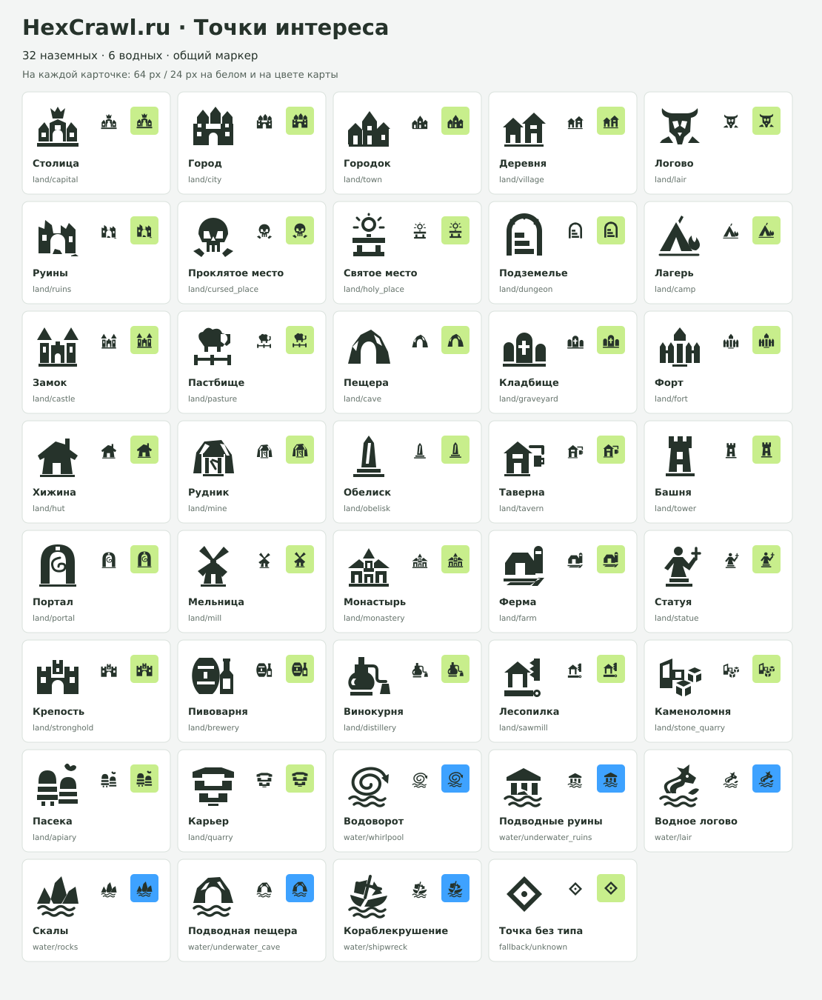

# Точки интереса — SVG для оценки

38 значков для всех типов из `src/App.tsx`: 32 наземных и 6 водных. Дополнительно — общий маркер точки без назначенного типа.

Один цвет `#26332b`, прозрачный фон, `viewBox="0 0 64 64"`. Все элементы — векторная геометрия; без шрифтов, встроенных растров, фильтров и внешних ресурсов.

[Общий лист всех значков](preview.svg) · [Сопоставление типов и файлов](manifest.json)

После подключения в приложении пути будут начинаться с `/poi/`, например `/poi/land/village.svg` и `/poi/water/lair.svg`. Ключ `lair` намеренно имеет два разных рисунка для суши и воды.

## Наземные

| Тип | 64 px | 24 px | SVG |
|---|:---:|:---:|---|
| Столица |  |  | [capital.svg](land/capital.svg) |
| Город |  |  | [city.svg](land/city.svg) |
| Городок |  |  | [town.svg](land/town.svg) |
| Деревня |  |  | [village.svg](land/village.svg) |
| Логово |  |  | [lair.svg](land/lair.svg) |
| Руины |  |  | [ruins.svg](land/ruins.svg) |
| Проклятое место |  |  | [cursed_place.svg](land/cursed_place.svg) |
| Святое место |  |  | [holy_place.svg](land/holy_place.svg) |
| Подземелье |  |  | [dungeon.svg](land/dungeon.svg) |
| Лагерь |  |  | [camp.svg](land/camp.svg) |
| Замок |  |  | [castle.svg](land/castle.svg) |
| Пастбище |  |  | [pasture.svg](land/pasture.svg) |
| Пещера |  |  | [cave.svg](land/cave.svg) |
| Кладбище |  |  | [graveyard.svg](land/graveyard.svg) |
| Форт |  |  | [fort.svg](land/fort.svg) |
| Хижина |  |  | [hut.svg](land/hut.svg) |
| Рудник |  |  | [mine.svg](land/mine.svg) |
| Обелиск |  |  | [obelisk.svg](land/obelisk.svg) |
| Таверна |  |  | [tavern.svg](land/tavern.svg) |
| Башня |  |  | [tower.svg](land/tower.svg) |
| Портал |  |  | [portal.svg](land/portal.svg) |
| Мельница |  |  | [mill.svg](land/mill.svg) |
| Монастырь |  |  | [monastery.svg](land/monastery.svg) |
| Ферма |  |  | [farm.svg](land/farm.svg) |
| Статуя |  |  | [statue.svg](land/statue.svg) |
| Крепость |  |  | [stronghold.svg](land/stronghold.svg) |
| Пивоварня |  |  | [brewery.svg](land/brewery.svg) |
| Винокурня |  |  | [distillery.svg](land/distillery.svg) |
| Лесопилка |  |  | [sawmill.svg](land/sawmill.svg) |
| Каменоломня |  |  | [stone_quarry.svg](land/stone_quarry.svg) |
| Пасека |  |  | [apiary.svg](land/apiary.svg) |
| Карьер |  |  | [quarry.svg](land/quarry.svg) |

## Водные

| Тип | 64 px | 24 px | SVG |
|---|:---:|:---:|---|
| Водоворот |  |  | [whirlpool.svg](water/whirlpool.svg) |
| Подводные руины |  |  | [underwater_ruins.svg](water/underwater_ruins.svg) |
| Логово (водное) |  |  | [lair.svg](water/lair.svg) |
| Скалы |  |  | [rocks.svg](water/rocks.svg) |
| Подводная пещера |  |  | [underwater_cave.svg](water/underwater_cave.svg) |
| Кораблекрушение |  |  | [shipwreck.svg](water/shipwreck.svg) |

## Общий маркер

| Тип | 64 px | 24 px | SVG |
|---|:---:|:---:|---|
| Точка без типа |  |  | [unknown.svg](unknown.svg) |

## Состав набора

- Названия и ключи сверены с `CENTRAL_POI_DETAILS`, `POI_DETAILS` и `WATER_POI_DETAILS`.
- Центральные и обычные точки одного типа используют один файл.
- `manifest.json` содержит пути относительно этой папки и подписи RU/EN.
- `preview.svg` — обзор для оценки; отдельные рисунки находятся в `land/`, `water/` и `unknown.svg`.
- Размер 24 px в таблице нужен для оценки читаемости в масштабе карты.
