# Точки интереса — версия 2

32 наземных значка, 6 водных и общий маркер. Простые силуэты объектов и характерных для них предметов.

[Первая версия](../README.md) · [Сравнить обе версии](comparison.svg) · [Обзор v2](preview.svg) · [Manifest](manifest.json)

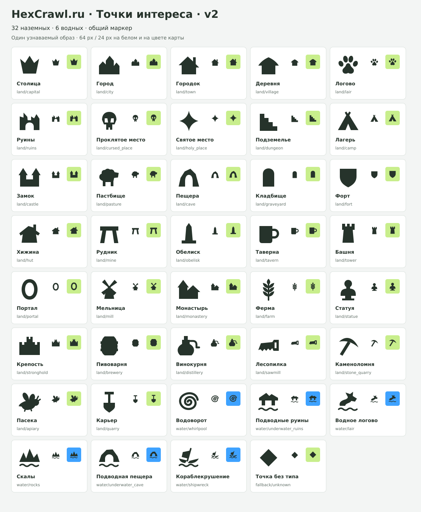

Один цвет `#26332b`, прозрачный фон, `viewBox="0 0 64 64"`. По возможности смысл передаётся внешним контуром. Просветы оставлены у кружки, пилы, портала и черепа для узнаваемости. Входы в пещеры и другие открытые формы сохраняют смысловые выемки.

Первая версия в родительской папке сохранена целиком. Файлы второй версии доступны по пути `/poi/v2/…` после будущего подключения. Приложение пока не использует этот набор.

## Пример на карте

[Столица на лесном гексе — SVG](examples/capital-forest.svg) · [PNG](examples/capital-forest.png)

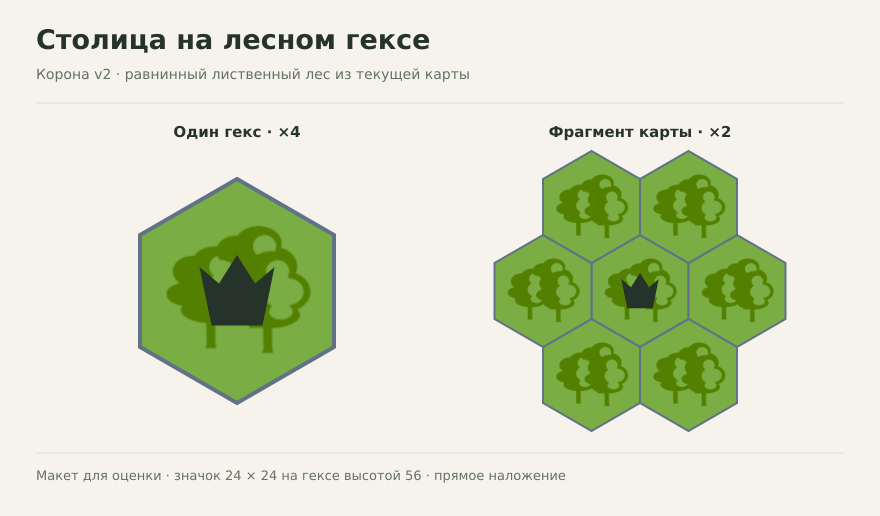

Макет использует текущий тайл `Lowland_deciduous_forest.png`, геометрию и границы гекса из приложения. Корона v2 показана без изменений, по центру, в предлагаемом размере 24 × 24 на гексе высотой 56. Слева увеличение ×4, справа ×2. Размер нового SVG пока выбран только для примера; текущий одиночный эмодзи в приложении имеет размер шрифта 16. Фоновый тайл встроен в SVG примера для автономного просмотра.

## Наземные

| Тип и символ | Было · 64 px | Стало · 64 px | Стало · 24 px | Файл v2 |
|---|:---:|:---:|:---:|---|
| Столица — Корона | 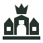 | 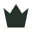 |  | [capital.svg](land/capital.svg) |
| Город — Профиль города | 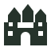 | 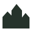 |  | [city.svg](land/city.svg) |
| Городок — Дом с крутой крышей | 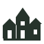 | 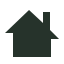 |  | [town.svg](land/town.svg) |
| Деревня — Широкая хижина | 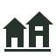 | 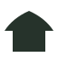 |  | [village.svg](land/village.svg) |
| Логово — След лапы |  | 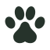 |  | [lair.svg](land/lair.svg) |
| Руины — Разрушенная стена | 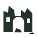 | 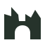 |  | [ruins.svg](land/ruins.svg) |
| Проклятое место — Череп |  |  |  | [cursed_place.svg](land/cursed_place.svg) |
| Святое место — Сияние |  |  |  | [holy_place.svg](land/holy_place.svg) |
| Подземелье — Ступени вниз |  | 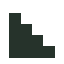 |  | [dungeon.svg](land/dungeon.svg) |
| Лагерь — Палатка | 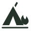 | 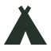 |  | [camp.svg](land/camp.svg) |
| Замок — Замок с двумя башнями | 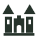 | 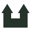 |  | [castle.svg](land/castle.svg) |
| Пастбище — Овца | 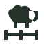 | 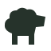 |  | [pasture.svg](land/pasture.svg) |
| Пещера — Вход в скале | 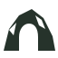 | 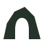 |  | [cave.svg](land/cave.svg) |
| Кладбище — Одно надгробие | 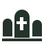 | 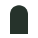 |  | [graveyard.svg](land/graveyard.svg) |
| Форт — Щит |  | 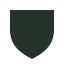 |  | [fort.svg](land/fort.svg) |
| Хижина — Хижина с трубой | 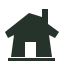 | 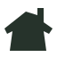 |  | [hut.svg](land/hut.svg) |
| Рудник — Вход с деревянными опорами | 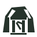 | 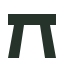 |  | [mine.svg](land/mine.svg) |
| Обелиск — Обелиск | 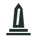 | 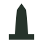 |  | [obelisk.svg](land/obelisk.svg) |
| Таверна — Кружка | 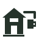 |  |  | [tavern.svg](land/tavern.svg) |
| Башня — Одна башня | 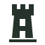 | 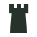 |  | [tower.svg](land/tower.svg) |
| Портал — Овальный портал |  | 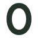 |  | [portal.svg](land/portal.svg) |
| Мельница — Мельница | 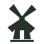 | 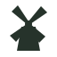 |  | [mill.svg](land/mill.svg) |
| Монастырь — Монастырская колокольня | 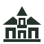 | 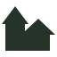 |  | [monastery.svg](land/monastery.svg) |
| Ферма — Колосок |  | 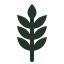 |  | [farm.svg](land/farm.svg) |
| Статуя — Бюст на постаменте | 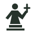 |  |  | [statue.svg](land/statue.svg) |
| Крепость — Крепостные стены | 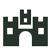 | 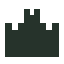 |  | [stronghold.svg](land/stronghold.svg) |
| Пивоварня — Бочка |  | 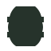 |  | [brewery.svg](land/brewery.svg) |
| Винокурня — Перегонный куб | 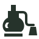 | 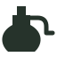 |  | [distillery.svg](land/distillery.svg) |
| Лесопилка — Пила |  |  |  | [sawmill.svg](land/sawmill.svg) |
| Каменоломня — Кирка | 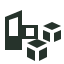 |  |  | [stone_quarry.svg](land/stone_quarry.svg) |
| Пасека — Пчела |  | 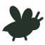 |  | [apiary.svg](land/apiary.svg) |
| Карьер — Лопата | 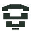 | 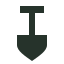 |  | [quarry.svg](land/quarry.svg) |

## Водные

| Тип и символ | Было · 64 px | Стало · 64 px | Стало · 24 px | Файл v2 |
|---|:---:|:---:|:---:|---|
| Водоворот — Спираль воды |  |  |  | [whirlpool.svg](water/whirlpool.svg) |
| Подводные руины — Разрушенный храм |  |  |  | [underwater_ruins.svg](water/underwater_ruins.svg) |
| Водное логово — Морской зверь |  |  |  | [lair.svg](water/lair.svg) |
| Скалы — Скалы над водой |  |  |  | [rocks.svg](water/rocks.svg) |
| Подводная пещера — Пещера у воды |  |  |  | [underwater_cave.svg](water/underwater_cave.svg) |
| Кораблекрушение — Разбитый корабль |  |  |  | [shipwreck.svg](water/shipwreck.svg) |

## Общий маркер

| Тип и символ | Было · 64 px | Стало · 64 px | Стало · 24 px | Файл v2 |
|---|:---:|:---:|:---:|---|
| Точка без типа — Ромб |  |  |  | [unknown.svg](unknown.svg) |

## Сравнение

Обе версии ниже показаны на одном фоне в одинаковых размерах 64 и 24 px.

